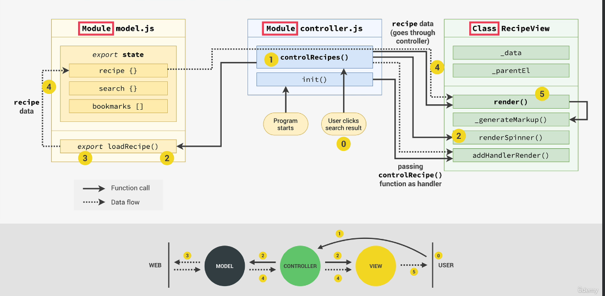

# MVC-Architecture

<h2>Why worry about arhcitecture?</h2>

1) The architecture will give our project structure in which we can then write the code. In software, structure basically means how we organize and divide the code into different modules, classes, and functions.

2) Maintainability, when we build a project, we always need to think about the future and keep in mind that the project is never really done. We need to be able to easily change it in the future.

3) Expandability, the ability to easily add new features in the future.

<h2>Components of any architecture</h2>

<h2>Model-View-Controller Architecture</h2>

Example of MVC:

MVC Implementation:

